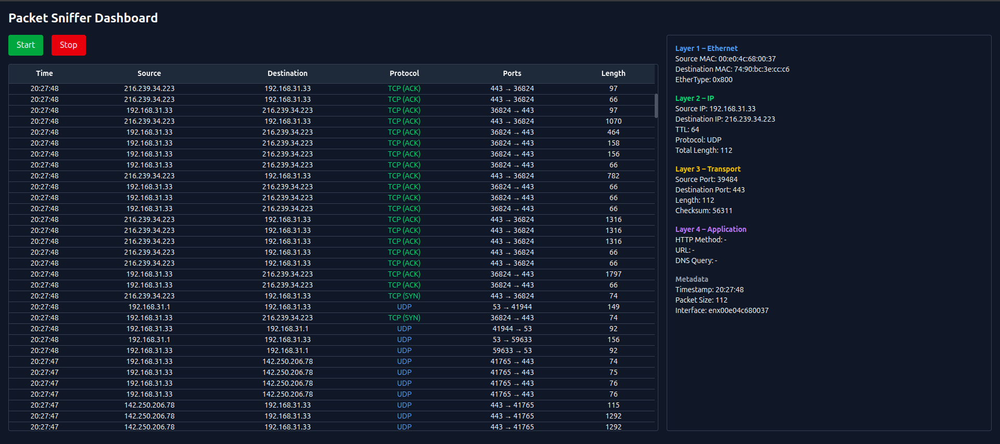
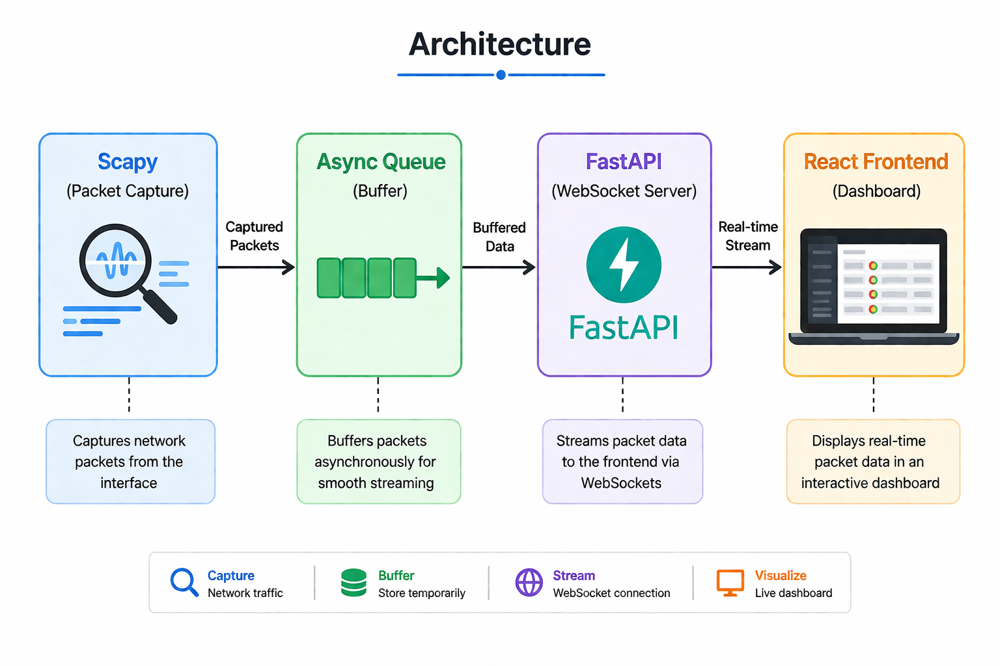

# 🔍 Network Packet Sniffer Dashboard

A full-stack real-time network packet analyzer that captures live network traffic and visualizes it through an interactive web dashboard.  
It provides structured insights into packets across multiple protocol layers in a simple and accessible interface.

---

## 🚀 Overview

This project is a lightweight, web-based packet analyzer inspired by tools like Wireshark.  
It captures packets using Python and streams them in real time to a frontend dashboard, where users can monitor and inspect network activity.

---

### 📊 Dashboard

---

## 🧠 Key Features

### 📡 Real-Time Packet Capture
- Live packet sniffing with instant updates
- WebSocket-based streaming to frontend

### 📊 Interactive Dashboard
- Tabular view with timestamp, IPs, protocol, ports, and length
- Scrollable packet history with start/stop controls

### 🧩 Layered Packet Inspection
- Detailed breakdown across Ethernet, IP, Transport, and Application layers
- Protocol-aware visualization with color coding

---

## 🧱 Architecture

---

## ⚙️ Technologies Used

- **Backend:** FastAPI, Scapy, WebSockets  
- **Frontend:** React, Tailwind CSS  
- **Communication:** Real-time WebSocket streaming  

---

## 👨‍💻 Creator

**Mohith D L**  
📧 mohithdl1803@gmail.com